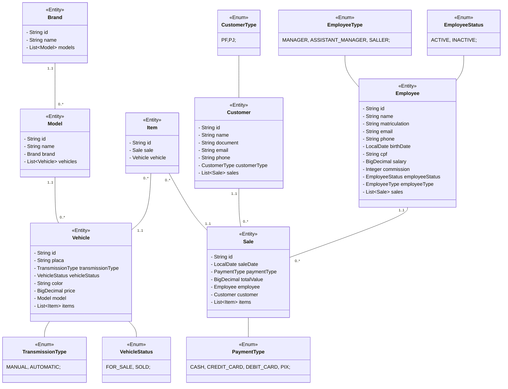

# Concessionria [](https://github.com/abnerjosefelixbarbosa/concessionria/actions/workflows/maven.yml)

# Sobre

Aplicativo web para gerenciamento de concessionaria.

## Modelo



# Recursos do projeto

## Backend

- Spring Boot
- H2 DB
- PostgreeSQL
- Spring Data JPA
- MVC
- SOLID

## Fucionalidades

- Registrar funcionario.
- Atualizar funcionario pelo id.
- Listar funcionario filtrado pelo nome, status do funcionário ou tipo do funcionário.
- Procurar funcionario pelo id.
- Registrar cliente.
- Atualizar cliente pelo id.
- Listar cliente filtrado pelo nome.
- Procurar cliente pelo id.

# Execução do projeto 

- Copie o repositorio em uma IDE.
- Execute o projeto.

```bash
# clone repository
git clone https://github.com/abnerjosefelixbarbosa/api-controle-de-estoque.git
```

# Autor

Abner José Felix Barbosa

[](https://www.linkedin.com/in/abner-jose-feliz-barbosa/)
